.. _xref-pynastran_gui:

==============================
Graphical User Interface (GUI)
==============================

********
Overview
********

The pyNastran GUI was originally developed to solve a data validation problem.
It's hard to validate that things like coordinate systems were correct if you
can't look at the geometry in a native format.  As time went on, niche features
that were needed (e.g., aero panels) that were not supported natively in
Patran 2005, were added.  The goal is not to replace a code like Patran or
FEMAP, but instead complement it.

Since the initial development, the GUI has become significantly more capable
by adding features such as displacements and forces, so the need for a code like
Patran has decreased, but will not be eliminated.

Introduction
============

The Graphical User Interface (GUI) looks like:

.. image:: ../../../pyNastran/gui/images/qt.png

A somewhat messy, but more featured image:

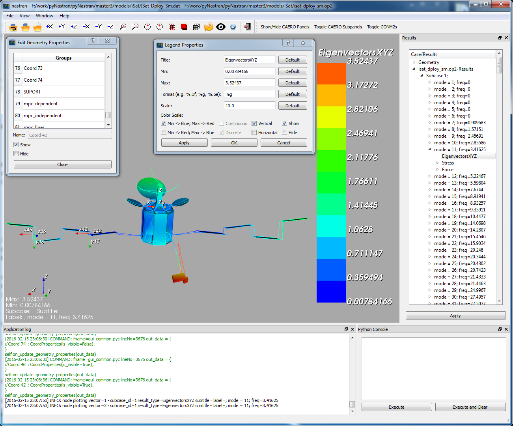

The GUI also has a sidebar and transient support.

Advantages of pyNastranGUI
--------------------------
 - command line interface for loading models
 - simple scripting
 - nice looking models
 - intuitive rotation
 - niche features
   - aero panels
   - aero splines
   - aero spline points
   - control surfaces
 - custom results from a CSV file
 - 64 bit support
   - Patran 2005 can't read in models that pyNastranGUI can
   - not an advantage for newer versions
 - animated gifs

Advantages of Patran/FEMAP
--------------------------
 - CAD geometry support (e.g., IGES, Parasolid)
 - geometry creation (e.g., points, surfaces)
 - meshing
 - edit materials/properties
 - much better picking support
 - much better groups
 - better use of memory
 - many more...

Purpose of additional formats
=============================
Over time, pyNastran has also added converter and GUI support for additional
formats.  Nastran is not the only piece of the analysis puzzle and there is
a need for niche engineering formats.

While, you could convert a Cart3d model (a simple triangulation) to another
format like Nastran, you would need to map the geometry/result quantity of
interest (e.g., Mach Number) to something like pressure.  That's unintuitive
and also requires writing an ill-defined format converter.  It's nice to load
it natively as you can also automatically create other quantities (e.g., the
bounding CFD box, free edges).

Finally, adding support for alternate formats drives GUI development.  The model
reload functionality was added to address loading the latest time step of a Usm3d
model.  It was repurposed to reload the geometry for other formats.  This is very
useful when creating aero panels and you want to see your changes.  The groups
functionality benefits all formats.

Additional formats include:

   - panair
   - cart3d
   - stl
   - tecplot
   - AFLR
    - bsurf
    - surf
    - ugrid
   - usm3d

Setup Note
==========
Download the entire package from Github or just the `GUI
<https://sourceforge.net/projects/pynastran/files/?source=navbar/>`_ executable.

If you download the source, make sure you follow the :doc:`installation` and use
**setup.py develop** and not **setup.py install**.

For the GUI, the main **requires**:
 - Python 3.7-3.10
 - any version of numpy
 - any version of scipy
 - ``vtk==7`` or ``vtk==8`` or ``vtk==9`` (best in 7 or 8)
 - ``PyQt5/6`` or ``PySide2/6``
 - other minor packages

Running the GUI
===============
On the command line:

.. code-block:: console

  >>> pyNastranGUI

To view the options:

.. code-block:: console

  >>> pyNastranGUI --help

    Usage:
      pyNastranGUI [-f FORMAT] INPUT [-o OUTPUT]
                   [-s SHOT] [-m MAGNIFY]
                   [-g GSCRIPT] [-p PSCRIPT]
                   [-u POINTS_FNAME...] [--user_geom GEOM_FNAME...]
                   [-q] [--groups]
      pyNastranGUI [-f FORMAT] INPUT OUTPUT [-o OUTPUT]
                   [-s SHOT] [-m MAGNIFY]
                   [-g GSCRIPT] [-p PSCRIPT]
                   [-u POINTS_FNAME...] [--user_geom GEOM_FNAME...]
                   [-q] [--groups]
      pyNastranGUI [-f FORMAT] [-i INPUT] [-o OUTPUT...]
                   [-s SHOT] [-m MAGNIFY]
                   [-g GSCRIPT] [-p PSCRIPT]
                   [-u POINTS_FNAME...] [--user_geom GEOM_FNAME...]
                   [-q] [--groups]
      pyNastranGUI -h | --help
      pyNastranGUI -v | --version

    Primary Options:
      -f FORMAT, --format FORMAT  format type (avus, cart3d, lawgs, nastran, panair,
                                               plot3d, stl, surf, tetgen, ugrid, usm3d)
      -i INPUT, --input INPUT     path to input file
      -o OUTPUT, --output OUTPUT  path to output file

    Secondary Options:
      -g GSCRIPT, --geomscript        path to geometry script file (runs before load geometry)
      -p PSCRIPT, --postscript        path to post script file (runs after load geometry)
      -s SHOT, --shots SHOT           path to screenshot (only 1 for now)
      -m MAGNIFY, --magnify           how much should the resolution on a picture be magnified [default: 5]
      --groups                        enables groups
      --user_geom GEOM_FNAME          add user specified points to an alternate grid (repeatable)
      -u POINTS_FNAME, --user_points  add user specified points to an alternate grid (repeatable)

    Info:
      -q, --quiet    prints debug messages (default=True)
      -h, --help     show this help message and exit
      -v, --version  show program's version number and exit

The standard way to run the code is simply by launching the exe.
Alternatively, you can call it from the command line, which can directly
load a model:

.. code-block:: console

  >>> pyNastranGUI -f nastran -i model.bdf -o model1.op2 -o model2.op2

The **solid_bending.bdf** and **solid_bending.op2** files have been included
as examples that work in the GUI.  They are inside the "models" folder
(at the same level as ``setup.py``).

You can also run it like:

  >>> pyNastranGUI model.bdf model1.op2

Here the code will guess based on your file extension what your file format is.
If you want to load a second OP2, you must use ``-o model2.op2``.

Features
========
 * fringe plot support

   * elemental/nodal results
   * custom CSV results

 * deflection results
 * force results

 * command line interface
 * scripting capability
 * high resolution screenshot
 * show/hide elements

   * can edit properties (e.g. color/opacity/size) using
     ``Edit Geometry Properties...`` on the ``View`` menu

 * legend menu
 * animation menu
 * save/load view menu

Minor Features
==============
 * snap to axis
 * clipping customization menu
 * edges flippable from menu
 * change label color/size menu
 * change background color
 * attach simplistic custom geometry with the ``Load CSV User Geometry`` or the ``-user_geom`` option
 * additional points may be added with the ``Load CSV User Points`` or the ``--user_points`` option

Nastran Specific Features
=========================
 * attach multiple OP2 files
 * supports SPOINTs
 * displacement/eigenvectors/nodal force results

   * scale/phase editable from legend menu
   * rotated into global frame

 * Edit Geometry Properties

   * SPC/MPC/RBE constraints
   * CAERO panel, subpanels
   * AEFACT control surfaces
   * SPLINE panels/points
   * bar/beam orientation vectors
   * CONM2

BDF Requirements
================
 * Entire model can be cross-referenced
 * Same requirements as BDF (include an executive/case control deck, define
   all cross-referenced cards, etc.)

Versioning Note
---------------
The GUI download is typically newer than the latest release version.

Additional Formats
==================
Some of the results include:

   * **Nastran** ASCII input (\*.bdf, \*.nas, \*.dat, \*.pch, \*.ecd); binary output (\*.op2)

     * geometry

        * node ID
        * element ID
        * property ID
        * material ID
        * thickness
        * normal
        * shell offset
        * PBAR/PBEAM/PBARL/PBEAML type
        * element quality (min/max interior angle, skew angle, taper ratio, area ratio)

     * real results
         * stress, strain
         * displacement, eigenvector, temperature, SPC forces, MPC forces, load vector
     * complex results
         * displacement, eigenvector

   * **Cart3d** ASCII/binary input (\*.tri); ASCII output (\*.triq)

     * Node ID
     * Element ID
     * Region
     * Cp, p, U, V, W, E, rho, rhoU, rhoV, rhoW, rhoE, Mach
     * Normal

   * **LaWGS** input (\*.wgs)

   * **Panair** input (\*.inp); output (agps, \*.out)

     * Patch ID
     * Normal X/Y/Z
     * Centroid X/Y/Z
     * Area
     * Node X/Y/Z
     * Cp

   * **STL** ASCII/binary input (\*.stl)

     * Normal X/Y/Z

   * **Tetgen** input (\*.smesh)

   * **Usm3d** surface input (\*.front, \*.cogsg); volume input (\*.cogsg); volume output (\*.flo)

     * Boundary Condition Region
     * Node ID
     * Cp, Mach, T, U, V, W, p, rhoU

*****************
Features Overview
*****************

Edit Geometry Properties
========================
The View -> "Edit Geometry Properties" menu brings up:

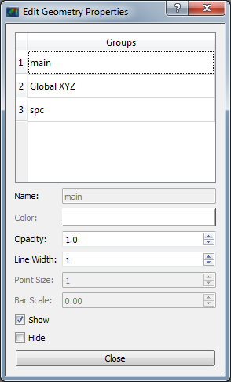

This menu allows you to edit the opacity, line width, point size, show/hide various
things associated with the model.  The geometry auto-updates when changes are made.

Modify Legend
=============
The View -> "Modify Legend" menu brings up:

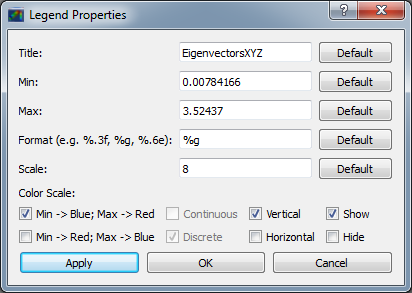

This menu allows you to edit the max/min values of the legend as well as the orientation,
number format (e.g. float precision) and deflection scale.  Defaults are stored, so
they may always be gone back to.  The geometry will update when Apply/OK is clicked.
OK/Cancel will close the window.

Animation Menu
==============

The animation menu is a sub-menu found on the ``legend menu``.
Hover over the cells for more information.

Animation of Displacment/Mode Shapes (Animate Scale)
----------------------------------------------------
You must load the animation menu when a displacement-like result is active.
You may then change to a scalar result to show during the animation.  For the
following SOL 101 static deflection result, **Animate Scale** is used to scale
the current result (Displacement).  The ``iCase`` value corresponds to
case that is currently active (Displacement) and is automatically populated when
you click the ``Create Animation`` button from the Legend menu.

If you would like to plot a separate result (e.g., Node ID), switch to that
result.  The iCase value will not change.  When you click ``Run All``, the ``iCase``
value is pulled and the deflection shape is calculated.  Make sure you actually
have a deflected geometry.

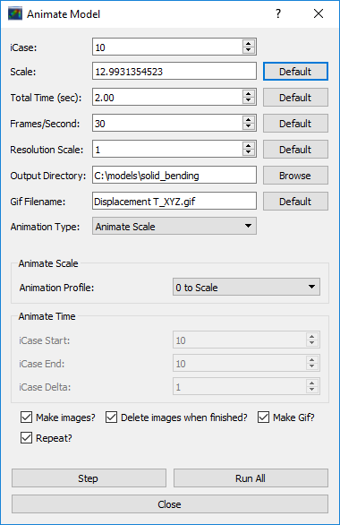

In your output folder, you will find:

.. image:: ../../../pyNastran/gui/images/solid_bending.gif

If the file is too big, shrink the size of the window.  Make the max deflection of
the image fill the screen.  Leave minimal whitespace.

.. note:: If unlickling ``Repeat?`` doesn't disable gif looping, upgrade ``imageio``.

Animation of Complex Mode Shapes (Animate Phase)
------------------------------------------------

Complex Mode Shapes are simple and similar to the ``Animate Scale`` option.
Here, the phase angle sweeps from 0 to 360 degrees.  Note that this option only
shows up when you have a complex result for ``iCase``.

.. image:: ../../../pyNastran/gui/images/animation_menu_freq.png

Animation of Time/Frequency/Load Step Results (Animate Time)
------------------------------------------------------------
This option is recommended only for constant time/frequency/load step results.
It is now necessary to learn how to set ``iCase``.  In the ``Application log``, you'll see:

.. code-block:: console

  COMMAND: fname=gui_qt_common.pyc lineNo=316 cycle_results(case=10)

Check your first (assume 10), second (assume 11), and final time step (assume 40)
for their ``iCase`` values.

For deflection results loaded from an OP2, the ``iCase Delta`` will be 1, but
depending on the frame rate and total time you want, you can skip steps.

.. image:: ../../../pyNastran/gui/images/animation_menu_time.png

Note that there is currently no way to plot a transient result other than the deflection
unless you want to use scripting.

Preferences Menu
================
The preferences menu allows you to change various settings.  These will be remembered
when you load model again.  The menu looks like:

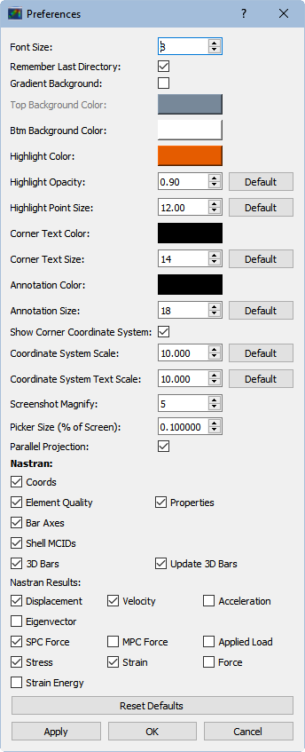

Hover over the cells for more information.

Windows preferences are stored in:
 - C:\Users\<me>\pyNastranGUI.json

Or Linux/Mac;
 - ~/pyNastranGUI.json

Picking Results
===============
Click on the ``Probe`` button to activate probing.  Now click on a node/element.
A label will appear .  This label will appear at the centroid of an elemental result
or the closest node to the selected location.  The value for the current result
quantity will appear on the model.  You can also press the ``p`` button.

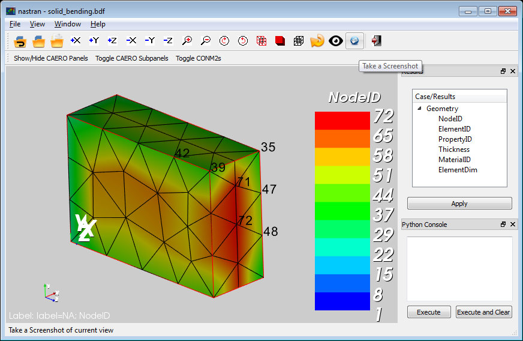

For "NodeID", the xyz of the selected point and the node in global XYZ space will be shown.
Labels may be cleared from the ``View`` menu.
Text color may also be changed from the ``View -> Preferences`` menu.

Note that for line elements, you need to be very accurate with your picking.
Zooming in does not help with picking like it does for shells.

Focal Point
===========
Click the following button and click on the rotation center point of the model.
The model will now rotate around that point.

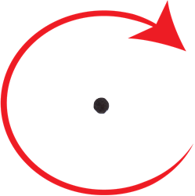

Alternatively, hover over the point and press the ``f`` key.

Model Clipping
==============
Clipping let's you see "into" the model.

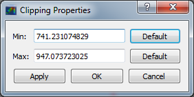

Zoom in and hover over an element and press the ``f`` key.
The model will pan and now rotate around that point.
Continue to hold ``f`` while the model recenters.
Eventually, the frame will clip.
Reset the view by clicking the Undo-looking arrow at the top.

**Note that clipping currently doesn't work...**

Modify Groups
=============
The View -> "Modify Groups" menu brings up:

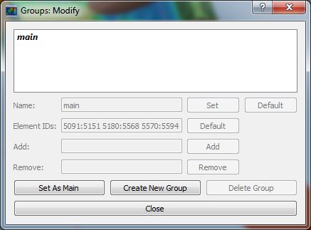

Had you first clicked View -> "Create Groups by Property ID", you'd get:

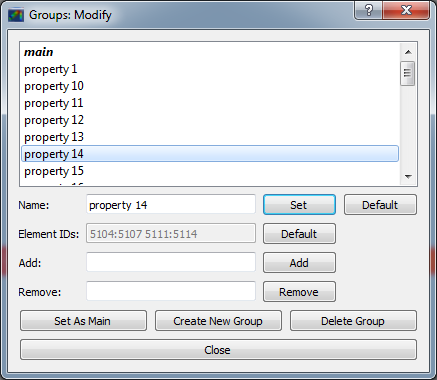

Add/Remove use the "Patran-style" syntax:

.. code-block :: console

    # elements 1 to 10 inclusive
    1:10

    # elements 100 to the end
    100:#

    # every other element 1 to 11 - 1, 3, 5, 7, 9, 11
    1:11:2

The name of the group may also be changed, but duplicate names are not allowed.
The "main" group is the entire geometry.

The bolded/italicized text indicates the group that will be displayed to the screen.
The defaults will be updated when you click ``Set As Main``.  This will also update
the bolded/italicided group.

Camera Views
============
The eyeball icon brings up a camera view.  You can set and save multiple camera views.
Additionally, views are written out for scripting.
You can script an external optimization process and take pictures every so many steps.

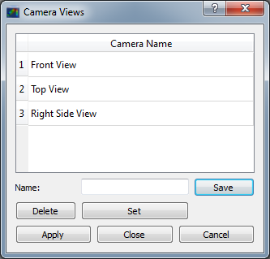

User Points
===========

User points allow you to load a CSV of xyz points.
These may be loaded from within the GUI or from the command line.

.. code-block:: console

    # x, y, z
    1.0, 2.0, 3.0
    4.0, 5.0, 6.0

These will show up as points in the GUI with your requested filename.

User Geometry
=============

User geometry is an attempt at creating a simple file format for defining geometry.
This may be loaded from the command line.  The structure will probably change.

The geometry may be modified from the ``Edit Geometry Properties`` menu.

.. code-block:: console

    # all supported cards
    #  - GRID
    #  - BAR
    #  - TRI
    #  - QUAD
    #
    # doesn't support:
    #  - solid elements
    #  - element properties
    #  - custom colors
    #  - coordinate systems
    #  - materials
    #  - loads
    #  - results

    #    id  x    y    z
    GRID, 1, 0.2, 0.3, 0.3
    GRID, 2, 1.2, 0.3, 0.3
    GRID, 3, 2.2, 0.3, 0.3
    GRID, 4, 5.2, 0.3, 0.3
    grid, 5, 5.2, 1.3, 2.3  # case insensitive

    #    ID, nodes
    BAR,  1, 1, 2
    TRI,  2, 1, 2, 3
    # this is a comment

    QUAD, 3, 1, 5, 3, 4
    QUAD, 4, 1, 2, 3, 4  # this is after a blank line

Custom Scalar Results
=====================
Custom Elemental/Nodal CSV/TXT file results may be loaded.  The order and
length is important.  Results must be in nodal/elemental sorted order.
The following example has 3 scalar values with 2 locations.  The
corresponding model must have **ONLY** two nodes.  By default, all results
must be floatable (e.g., no NaN values).

.. code-block:: console

      # element_id, x,   y, z
      1,            1.0, 2, 3.0
      2,            4.0, 5, 6.0

.. code-block:: console

      # element_id  x    y  z
      1             1.0  2  3.0
      2             4.0  5  6.0

You may also assign result types.

.. code-block:: console

      # element_id(%i), x(%f), y(%i), z(%f)
      1,                1.0,     2,     3.0
      2,                4.0,     5,     6.0

Custom Deflection Results
=========================
Custom Elemental/Nodal CSV/TXT file results may be loaded.  The order and
length is important.  Results must be in nodal/elemental sorted order.
The following example has 3 scalar values with 2 locations.  The model must
have **only** two nodes.

.. code-block:: console

      # result_name
      1.0     2     3.0
      2.0     5     6.0

Custom Results Specific Buttons
===============================
Nastran Static/Dynamic Aero solutions require custom cards that create
difficult to view, difficult to validate geometry.  The pyNastranGUI
aides in creating models.  The CAERO panels are seen when a model is loaded:

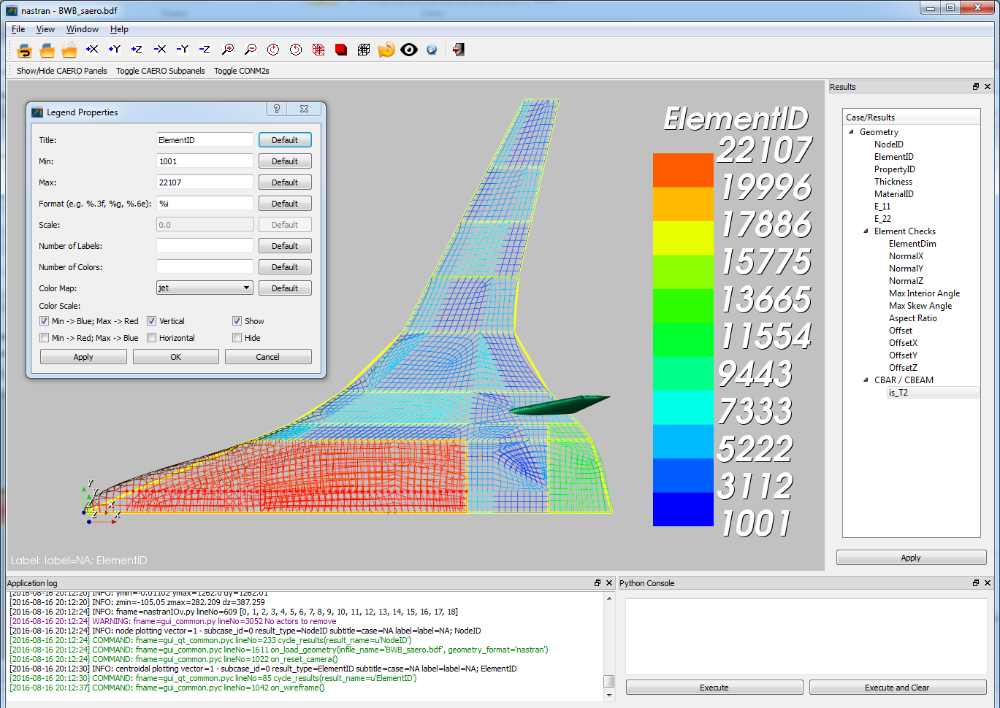

Additionally, by clicking the ``Toggle CAERO Subpanels`` button,
the subpanels may be seen:

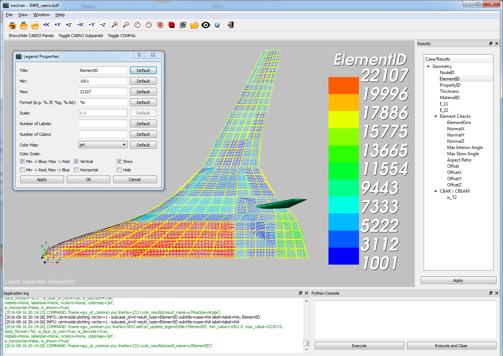

Additionally, flaps are shown from within the GUI.  SPLINE surfaces
are also generated and may be seen on the ``View`` -> ``Edit Geometry Properties``
menu.

*********
Scripting
*********
GUI commands are logged to the window with their call signature.
Scripting may be used to call any function in the GUI class.
Most of these commands are written to the ``COMMAND`` output.

For example, you can:

 - load geometry
 - load results
 - plot unsupported result types
 - custom animations of mode shapes
 - high resolution screenshots
 - model introspection
 - create custom annotations

Using the scripting menu
========================
The scripting menu allows for custom code and experimentation to be written
without loading a script from a file.  All valid Python is accepted.
Scripting commands should start with ``self.`` as they're left off from the menu.
Local variables do not need this.

Command line scripting
======================
``geomscript`` runs after the load_geometry method, while
``postscript`` runs after load_results has been performed

.. code-block :: python

    import sys
    self.on_take_screenshot('solid_bending.png', magnify=5)
    sys.exit()

.. code-block :: console

    >>> pyNastranGUI solid_bending.bdf solid_bending.op2 --postscript take_picture.py

High Resolution Screenshots
===========================

Option #1
---------

.. code-block:: python

    self.on_take_screenshot('solid_bending.png', magnify=5)

Option #2
---------

On the ``View`` -> ``Preferences`` menu, change **Screenshot Magnify** and click **Apply**.
Now take a screenshot.

Frequently Asked Questions
=======================================

**The legend font is way to big!**
Legend is tricky cause of the wide range in the number of 
title characters preferences.  

It's defined in terms of a percentage of screen size and the font size is
defined in terms of the title character (or number size), so it's tricky to
to get a robust system.  However, you do have some control:
 - legend title:
   - resize the window to be shorter
   - use the legend (View -> Modify Legend; Control+L) and add whitespace around the etitle
 - legend values:
   - resize the window to be narrower
   - use the legend (View -> Modify Legend; Control+L) and change the number format

**The origin font is waaaay too big!**

The origin size is dependent on zoom level and model size.  You can customize:
 - Origin size
 - Origin text size
in the Preferences menu (Control+P).

**I could not visualize the mesh edges within the results**

Mesh edges press **e** for edge and **b** if you want to make them black.  
There are also pull downs on the view menu and the e option is on the toolbar (the black wireframe)

**How do I clear a result?**

Right click on the **Case/Results** tree and go to **Clear Results**.

**It's not easy to change between results (such as Sxx, Syy, Mises, etc.) using only the arrows**

You can use K and L (lowercase) to "cycle" to different results.

** How do I make the gif more responsive/smaller? **

The GIF will be the same size as your screen (the part with the grey background), 
so make your window smaller.  In general, 30 frame/second is going to look nice, 
but you can even get away with 10 FPS if the picture is small.

** The GUI crashes when I have a model loaded and load a different one**

Yeah...it does that.  It's not really designed around loading differet models.
There are some objects that aren't deleted and it's tricky to do it right.  If
you mess one up, it crashes.

If you're just modifying a deck, you can use the "Reload Model" option.  
It'll reload the geometry and be quite a bit faster than going through menus.
That fails sometimes as well, but is more robust.

** The GUI crashes when loading an OP2? **

The code is trying to match the IDs in the geometry to the IDs in the results and they don't always match.  There is some handling of this, but it's not great.

Also, make sure you load the correct model too :)
