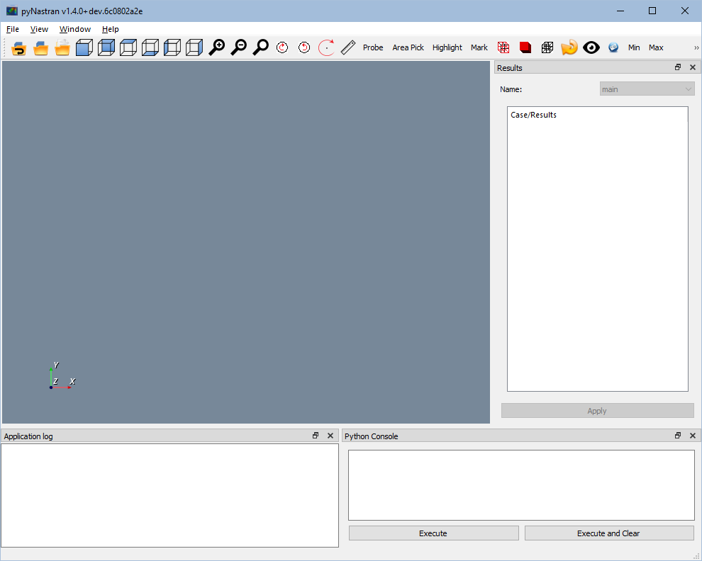
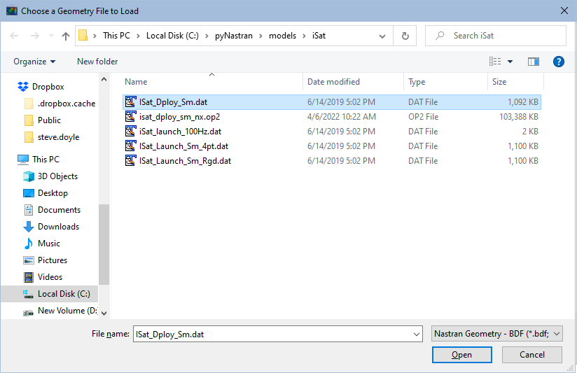
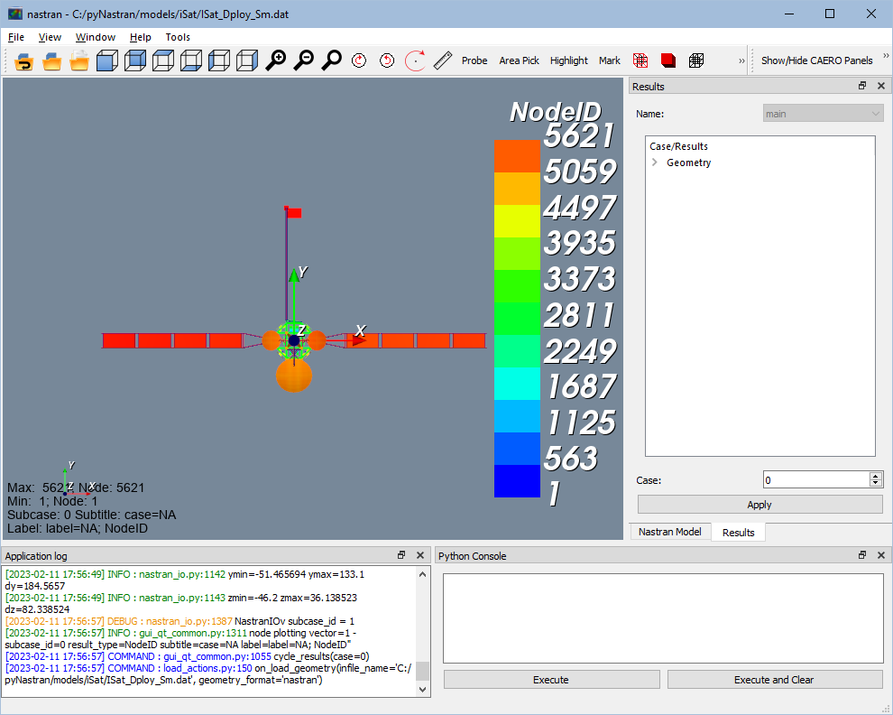
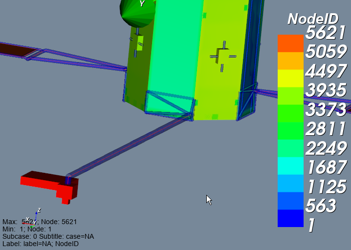
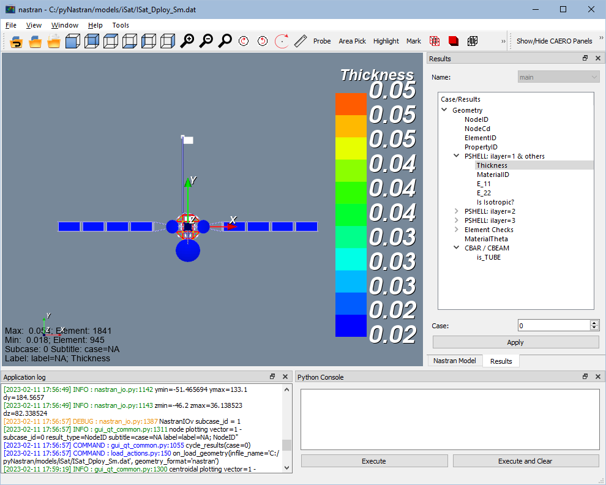
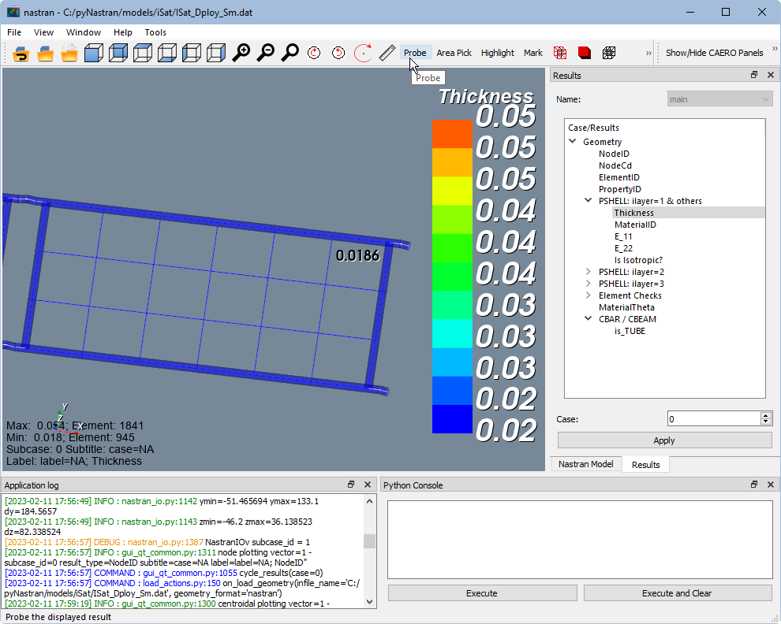
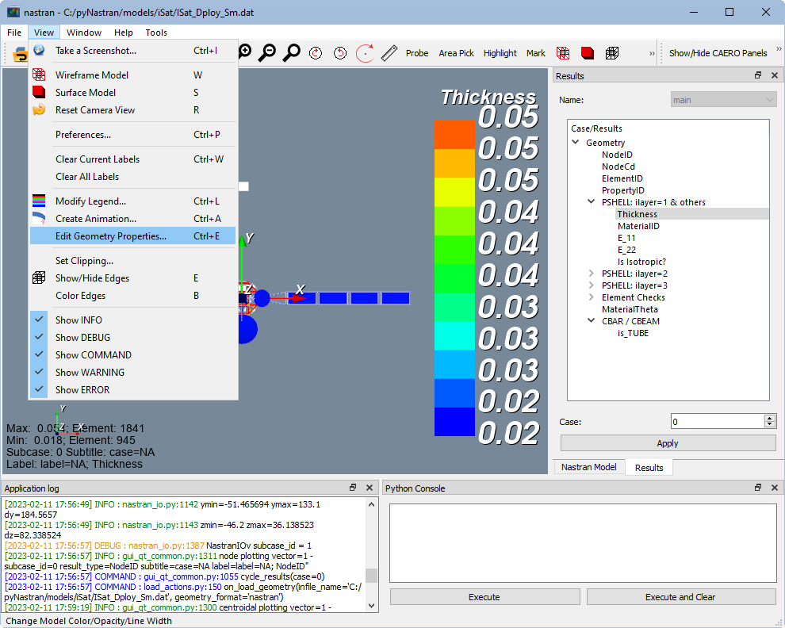
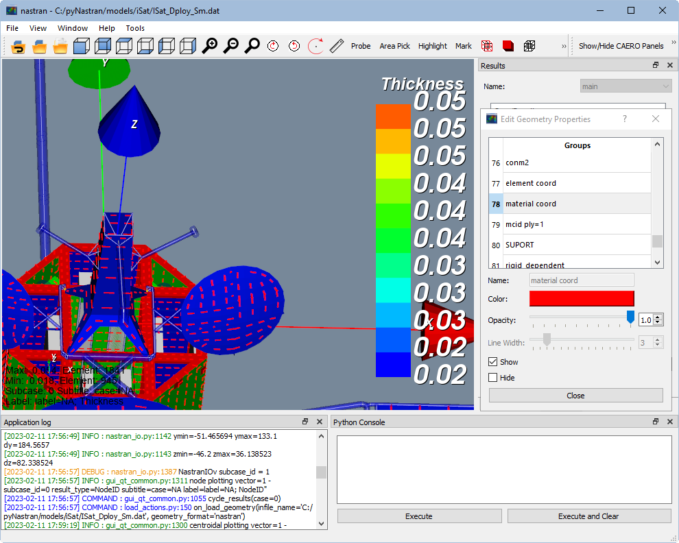

.. _xref-pynastran_gui_tutorial:

==============================
pyNastranGUI Walkthrough (GUI)
==============================

The pyNastran GUI is a destop application that supports modern platforms:

 - Windows 10
 - Linux
 - Mac

*******************
Opening the Program
*******************
There are a 2 different ways to run the GUI:
 - from an exe (binary is built for Windows only)
 - from command line

If you're using the binary, just open it like any program.

Otherwise, once you've installed pyNastran, open a terminal/command prompt and type:
```
pyNastranGUI
```
It's case insensitive (at least on Windows), but Linux/Mac are case sensitive.

Once you've loaded it, you'll get something that looks like this:




A nice bonus of the command line option is the default folder will be in the current directory, so it's faster to find models if you just start from where the file already is.

***********************
Loading a Nastran Model
***********************
If you've checked out pyNastran from github you'll find the ATA-E developed iSat model in:
 - "models/iSat/ISat_Dploy_Sm.dat"

Go to **File** -> **Load Geometry...** to make the following window pop up



And there's the satellite!


   
***********************
Basic Navigation
***********************
Main model navigation is intuitive with:
 - click left mouse + move: rotation
 - click right mouse + move: zoo
 - shift + left mouse: translate
 - control + left mouse: roll

When you're zooming around, notice there's a transparent blue highlighted region around the boom.  This is the 3D geometry of the line elements.  At shared node between two neighboring line elements, you'll even get a nice view of the cross section.  It's a little tricky to tell with such small tubes though.



You can also change the center of rotation by pressing on:
.. image:: ../../../../pyNastran/gui/icons/trotation_center.png
   :scale: 50%

and then clicking on the model.

***********************
Model Results
***********************

There's a tree structure to the right with the label **Results**.  Open the tree and navigate to the highlighted **Thicknss** result and click **Apply**.




This are the main "results" and you'll find things like element related info (element id, property id, thickness, element aspect ratio) as well as outputs like displacement, stress, and strain.

Zoom in on the solar panel and switch to wireframe (w) or **View** -> **Wireframe Model**.  Then click **Probe** from the toolbar (see below) and click on an element.  You should see 0.0186, which has a bit more precision than the 0.02.  If you were in surface/solid mode (s), depending on the angle of the model, the text may or may not be inside the model.

Probe will stay active until you unclick the box again.  You can also hover over the model and press (p) for Probe.  Have some fun painting the model with numbers and then go to **View** -> **Clear Current Labels**.  If you hadn't guessed, labels correspond to the active result (in this case Thickness).  If you switch to a different result, your labels will disappear, but come back when you return to the Thickness result.



Switch back to surface mode using the shortcut (s) or **View** -> **Surface Model**.

************************
Edit Geometry Properties
************************
Go to **Edit** -> **Edit Geometry Properties...** to load the following window.  From here you can show/hide secondary objects like:
 - Coordinate systems
 - Element/material coordinate systems
 - Aero panels (e.g., CAERO1, CAERO2)
 - Concentrated masses (CONM2)
 - Rigid element lines (e.g., RBE2, RBE3, MPC)
 - Independent/dependent degrees of freedom (e.g., RBE2, RBE3, MPC)
 - SUPORTs
 - 3D Bars (CBAR/CBEAM)
 - CBAR/CBEAM Orientation vectors




You'll see lots of coordinate systems, so you can click and turn each one on/off.  Scroll down to:




and click **Show**.

If you don't like the color/line thickness, go ahead and change that too.
