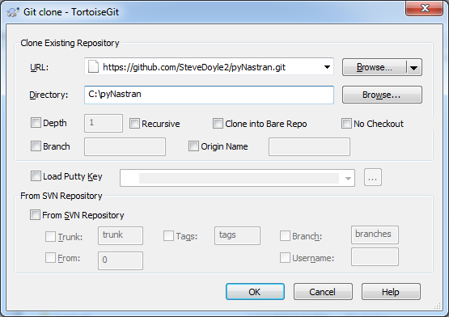

============
Installation
============

pyNastran is an easy package to install once you have the required Python
modules.  It's a pure Python package so you shouldn't have too many problems.

**********************************
Install Procedure - From a Release
**********************************

Overview
========
 * Install Python
 * Install numpy, scipy, pandas, vtk, PyQt4/5 (GUI)
 * Install numpy, scipy, pandas (no GUI)
 * Download pyNastran from Github
 * Navigate to pyNastran directory on the command line
 * Install the package

Download Python
===============
The software is tested against:
 - Python 2.7.14 (Windows/Linux)
 - Python 3.4 (Linux)
 - Python 3.5 (Windows/Linux)
 - Python 3.6 (Linux)

Options include:
 * `Anaconda Python <https://store.continuum.io/cshop/anaconda/>`_ (recommended)
 * `WinPython <http://winpython.sourceforge.net/>`_
 * Base `Python <https://www.python.org/downloads/>`_ with the unofficial
   `Windows binaries <http://www.lfd.uci.edu/~gohlke/pythonlibs/>`_

Make sure to get 64-bit Python, so memory usage becomes a non-issue.  It
shouldn't matter too much as long as your packages versions (e.g. numpy/scipy)
are consistent.  With either distribution, both Python and all 3rd party
packages will be installed.  **With base Python, you need to install the packages
by yourself.**

Additional packages
===================
The following packages are required.

 * `scipy 0.18.1+ <http://scipy.org/>`_
 * `numpy 1.11+ <http://numpy.org/>`_
 * `VTK 7.x, 8.x <http://www.vtk.org/VTK/resources/software.html>`_ (for the GUI)
 * `wxPython <http://wxpython.org/download.php#stable>`_ (for BDF/OP2/OP4 popups)
 * `PyQt4/PyQt5 <http://www.riverbankcomputing.com/software/pyqt/download>`_ (for the GUI; BDF/OP2/OP4 popups)
 * `pandas <http://pandas.pydata.org/>`_ (optional way to use the OP2 in the Jupyter Notebook)
 * imageio 2.2.0 (for the GUI; animations)

PyNastran's package requirements are tested with packages no older than 1 year
at the time of release.  If you require an older version, try changing version
requirements in ``setup.py``.  It shouldn't be that different, but pyNastran does
make use of numpy's "new" axis option in ``numpy.linalg.norm`` and there was a
major bug fix in Python 2.7.7, so buyer beware.

Regarding the GUI, for the master, ``VTK 7.x`` or ``8.x`` is required and PyQt4/5 are fine.
For the v1.0 release, Python 2.7 with ``vtk==5.10.1`` is best (``6.x`` and ``7.x`` will work) and PyQt4 is
recommended.

Download pyNastran
==================

If you want to most recent official release, either:

 1. Run

   .. code-block:: console

     >>> pip install pyNastran

 2. Download the most recent `release <https://github.com/SteveDoyle2/pyNastran/releases>`_
    (**required if you don't want to install the GUI**).

If you don't want the gui, use ``setup_no_gui.py`` instead of ``setup.py``.

Install pyNastran
=================
 * Navigate to pyNastran directory on the command line.  The ``setup.py`` file
   should exist in the current directory.

 * Either run...

   1. Able to edit the source code and have the changes propogate (recommended)

    .. code-block:: console

      >>> python setup.py develop

   2. Changes will not propogate

    .. code-block:: console

      >>> python setup.py install

If you don't want the gui, use ``setup_no_gui.py`` instead of ``setup.py``.

*******************************
Install Procedure - From Source
*******************************

Overview
========
 * Install Python
 * Install numpy, scipy, pandas, vtk, PyQt (GUI)
 * Install numpy, scipy, pandas (no GUI)
 * Install Sphinx, GraphViz, alabaster (for documentation)

 * Install Git
 * Clone pyNastran-master from Github
 * Install pyNastran

Install extra Python packages
=============================
Install Sphinx and alabaster

.. code-block:: console

  pip install Sphinx
  pip install alabaster

Install Git
===========

 * Download & install `Git <http://git-scm.com/>`_ (required)
 * Download a GUI for Git (optional)
    * `TortoiseGit <https://code.google.com/p/tortoisegit/>`_ (recommended for Windows)

Install pyNastran
=================
There are two ways to install the dev version of pyNastran

 1. Download the most recent `zip version <https://github.com/SteveDoyle2/pynastran/archive/master.zip>`_

 2. Clone pyNastran (see below).  Using Git allows you to easily update to the
    latest dev version when you want to as well as push any commits of your own.

If you don't want the gui, use ``setup_no_gui.py`` instead of ``setup.py``.

Cloning pyNastran using TortoiseGit
===================================
Right-click in a folder and select ``Git Clone``.

Enter the above information.  If desired, click the branch box and and enter a branch name
and click ``OK``.

Cloning pyNastran Using Command Line
====================================
Checkout/clone the dev code by typing (preferred):

.. code-block:: console

  >>> git clone https://github.com/SteveDoyle2/pynastran

To checkout a branch

.. code-block:: console

  >>> git.exe clone --branch v0.8 --progress -v "https://github.com/SteveDoyle2/pyNastran.git" "C:\\work\\pyNastran_v0.8"

Documentation
=============
Two options for documentation exist.

Build Docs
----------
Navigate to ``pyNastran/docs_sphinx`` directory on the command line.

.. code-block:: console

  >>> make html

Use Web docs
------------
The `web docs <http://pynastran-git.readthedocs.org/en/latest/>`_ aren't nearly as nice.

