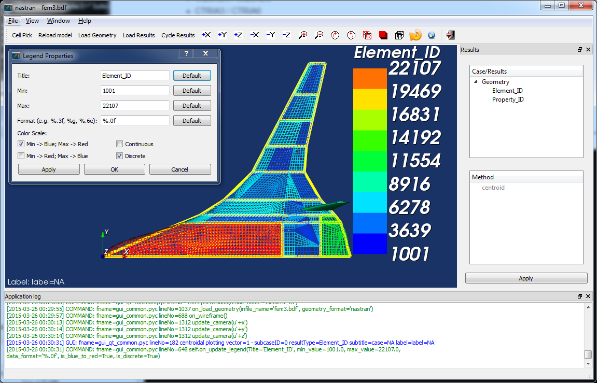
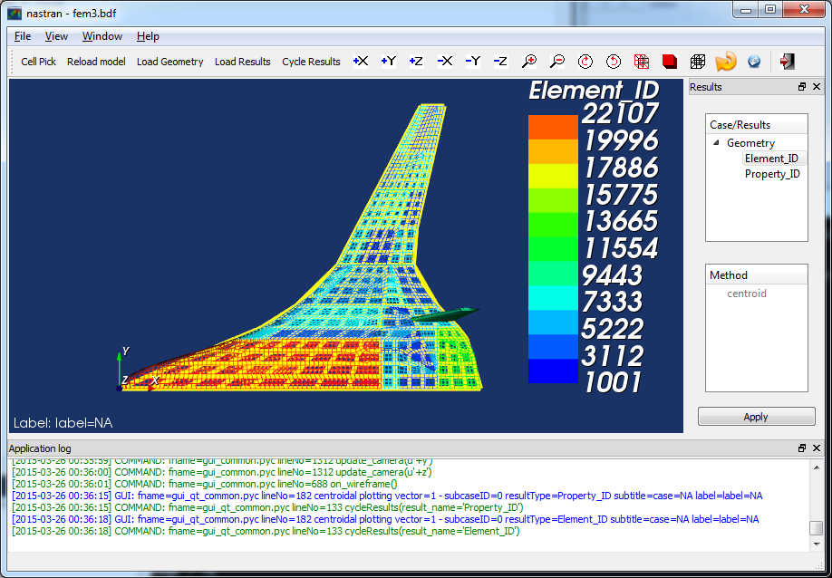

Graphical User Interface (GUI)
==============================

Setup Note
----------
Download the entire package from Github or just the `GUI 
<https://sourceforge.net/projects/pynastran/files/?source=navbar/>`_ executable.

If you download the source, make sure you follow the `Installation Guide 
<https://github.com/SteveDoyle2/pyNastran/wiki/Installation>`_ and use 
**setup.py develop** and not **setup.py install**.

Python 2.7 with ``vtk==5.10.1`` will give you the best looking GUI.
The GUI in vtk 6/7 won't let you see element edges.  The GUI in 
Python 3 won't save your settings.

Introduction
------------

The Graphical User Interface (GUI) looks like:

.. image:: ../../pyNastran/gui/qt.png

The GUI also has a sidebar and transient support.

Running the GUI
---------------
On the command line:

.. code-block:: console

  >>> pyNastranGUI

To view the options:

.. code-block:: console

  >>> pyNastranGUI --help

    pyNastranGUI [-f FORMAT] INPUT
                 [-s SHOT] [-m MAGNIFY]
                 [-g GSCRIPT] [-p PSCRIPT]
                 [-u POINTS_FNAME...]
                 [-q]
    pyNastranGUI [-f FORMAT] INPUT OUTPUT
                 [-s SHOT] [-m MAGNIFY]
                 [-g GSCRIPT] [-p PSCRIPT]
                 [-u POINTS_FNAME...]
                 [-q]
    pyNastranGUI [-f FORMAT] [-i INPUT] [-o OUTPUT...]
                 [-s SHOT] [-m MAGNIFY]
                 [-g GSCRIPT] [-p PSCRIPT]
                 [-u POINTS_FNAME...]
                 [-q]
    pyNastranGUI -h | --help
    pyNastranGUI -v | --version
  
  Options:
    -h, --help                  show this help message and exit
    -f FORMAT, --format FORMAT  format type (cart3d, lawgs, nastran, panair,
                                             plot3d, stl, tetgen, usm3d)
    -i INPUT, --input INPUT     path to input file
    -o OUTPUT, --output OUTPUT  path to output file
    -g GSCRIPT, --geomscript GSCRIPT  path to geometry script file (runs before load geometry)
    -p PSCRIPT, --postscript PSCRIPT  path to post script file (runs after load geometry)
    -s SHOT, --shots SHOT       path to screenshot (only 1 for now)
    -m MAGNIFY, --magnify       how much should the resolution on a picture be magnified [default: 5]
    -u POINTS_FNAME, --user_points POINTS_FNAME               add user specified points to an alternate grid (repeatable)
    -q, --quiet                 prints debug messages (default=True)
    -v, --version               show program's version number and exit

The standard way to run the code:

.. code-block:: console

  >>> pyNastranGUI -f nastran -i model.bdf -o model1.op2 -o model2.op2

The **solid_bending.bdf** and **solid_bending.op2** files have been included 
as examples that work in the GUI.  They are inside the "models" folder
(at the same level as setup.py).

Features
--------
 * Fringe Plot support
   - Custom Fringes supported
 * Command line interface
 * Scripting capability
 * High resolution screenshot (menu/button/keyboard)
 * Snap to Axis
 * Change Background Color

New Features
------------
 * nodal/element-based results at the same time
 * results may be shown alongside geometry
 * attach multiple OP2 files
 * displacement/eigenvectors now shown as a deformation (real)
 * SPC/MPC/RBE constraints are viewable
   * can edit properties (e.g. color/opacity/size) using 
     ``Edit Geometry Properties...`` on the ``View`` menu
   * additional points may be added with the ``-u`` option
   * bar/beam element orientation vectors
 * attach custom CSV (comma-delimited) or .txt (space/tab-delimited) files as
   either node-based or element-based results
 * legend is more robust
 * clipping customization menu
 * save view menu
 * supports SPOINTs
 * edges flippable from menu now

Supported Elements
------------------
 * CQUAD4 / CQUAD8
 * CTRIA3 / CTRIA6
 * CTETRA4 / CTETRA10
 * CHEXA8 / CHEXA20
 * CPENTA6 / CPENTA15
 * CSHEAR
 * CQUADR / CTRIAR
 * CBAR / CBEAM / CROD / CONROD / CELASx (displayed as lines)
 * CAERO1 (shown in yellow)
 * CONM2 (shown in yellow as points)

BDF Requirements
----------------
 * Entire model can be cross-referenced
 * Same requirements as BDF (include an executive/case control deck, define
   all cross-referenced cards, etc.)

Scripting
---------
GUI commands are logged to the window with their call signature.  Users may 
then use a custom Python script to take many pictures, show the sub-caero
panels, etc.  A sample CAERO script that shows individual CAERO subpanels
(instead of just the outline of the CAERO panel) is provided with the download.

For example, a model with CAERO elements:

can use the script:

.. code-block:: python

  self.show_cid = [1, 110000]
  self.is_sub_panels = True

and is called using:

.. code-block:: console

  >>> pyNastranGUI -f nastran -i bwb.bdf --script script.py

which creates:

Scripting may be used to call any function in the GUI class.  This includes 
dynamically loading geometry/results, changing results, taking screenshots, 
rotating the model, etc.  Most of these commands are written to the 
``COMMAND`` output.

Versioning Note
^^^^^^^^^^^^^^^
The GUI download is typically newer than the latest release version.

Additional Formats
------------------
The following results are supported:

   * **Nastran** ASCII input (\*.bdf, \*.nas, \*.dat, \*.pch); binary output (\*.op2)

     * real results only (no complex data)
     * stress, strain (centroidal)
     * displacement, eigenvector, temperature, SPC forces, MPC forces, load vector (nodal)

   * **Cart3d** ASCII/binary input (\*.tri); ASCII output (\*.triq)

     * Node ID (nodal)
     * Element ID (centroidal)
     * Region (centroidal)
     * Cp, p, U, V, W, E, rho, rhoU, rhoV, rhoW, rhoE, Mach (centroidal/nodal)
     * Normal X/Y/Z (nodal/centroidal)

   * **LaWGS** input (\*.wgs)

   * **Panair** input (\*.inp); output (agps, \*.out)

     * Patch ID
     * Normal X/Y/Z
     * Centroid X/Y/Z (centroidal)
     * Area (centroidal)
     * Node X/Y/Z (nodal)
     * Cp (nodal/centroidal)

   * **STL** ASCII/binary input (\*.stl)

     * Normal X/Y/Z

   * **Tetgen** input (\*.smesh)

   * **Usm3d** surface input (\*.front, \*.cogsg); volume input (\*.cogsg); volume output (\*.flo)

     * Boundary Condition Region (centroidal)
     * Node ID (nodal)
     * Cp, Mach, T, U, V, W, p, rhoU (nodal)

Graphical Issues
^^^^^^^^^^^^^^^^
You'll have the best performance if you run the GUI on Windows with an new 
NVIDIA graphics card and on a desktop.

If you're having issues, you should update the driver for your graphics card, 
especially if you have a laptop or Radeon card. For a desktop machine, go to 
the web site of the manufacturer of the graphics card. For a laptop, you should
normally go to the web site of the laptop manufacturer, though for NVIDIA you 
may now find a newer driver available from NVIDIA.

Issues include:
  1. the backfaces of elements not being colored
  2. the GUI not working

Application Log Dislay
^^^^^^^^^^^^^^^^^^^^^^
It's possible that the Application Log will not be visible.  This is a PyQt4
install issue.  Reinstalling may fix the problem, but using one of the
recommended distributions is both the easiest and most reliable way to fix
this problem.
