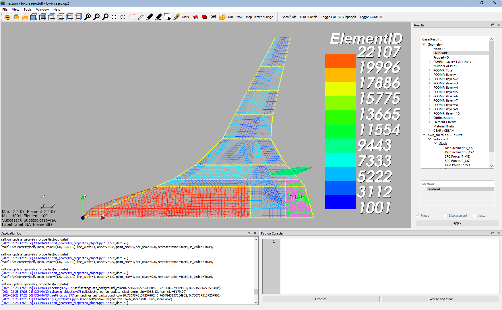

Graphical User Interface (GUI)
==============================

Setup Note
----------
Download the entire package from Github or just the `GUI
<https://sourceforge.net/projects/pynastran/files/?source=navbar/>`_ executable.

If you download the source, make sure you follow the `Installation Guide
<https://github.com/SteveDoyle2/pyNastran/wiki/Installation>`_ and use
**setup.py develop** and not **setup.py install**.

Python 2.7 with ``vtk==5.10.1`` will probably give you the best looking GUI.
VTK 6 and 7 probably still have some issues.
The GUI in Python 3 won't save your settings.

Introduction
------------

The Graphical User Interface (GUI) looks like:

.. image:: ../../pyNastran/gui/qt.png

The GUI also has a sidebar and transient support.

Running the GUI
---------------
On the command line:

.. code-block:: console

  >>> pyNastranGUI

To view the options:

.. code-block:: console

  >>> pyNastranGUI --help

    pyNastranGUI [-f FORMAT] INPUT
                 [-s SHOT] [-m MAGNIFY]
                 [-g GSCRIPT] [-p PSCRIPT]
                 [-u POINTS_FNAME...]
                 [-q]
    pyNastranGUI [-f FORMAT] INPUT OUTPUT
                 [-s SHOT] [-m MAGNIFY]
                 [-g GSCRIPT] [-p PSCRIPT]
                 [-u POINTS_FNAME...]
                 [-q]
    pyNastranGUI [-f FORMAT] [-i INPUT] [-o OUTPUT...]
                 [-s SHOT] [-m MAGNIFY]
                 [-g GSCRIPT] [-p PSCRIPT]
                 [-u POINTS_FNAME...]
                 [-q]
    pyNastranGUI -h | --help
    pyNastranGUI -v | --version

  Options:
    -h, --help                  show this help message and exit
    -f FORMAT, --format FORMAT  format type (cart3d, lawgs, nastran, panair,
                                             plot3d, stl, tetgen, usm3d)
    -i INPUT, --input INPUT     path to input file
    -o OUTPUT, --output OUTPUT  path to output file
    -g GSCRIPT, --geomscript GSCRIPT  path to geometry script file (runs before load geometry)
    -p PSCRIPT, --postscript PSCRIPT  path to post script file (runs after load geometry)
    -s SHOT, --shots SHOT       path to screenshot (only 1 for now)
    -m MAGNIFY, --magnify       how much should the resolution on a picture be magnified [default: 5]
    -u POINTS_FNAME, --user_points POINTS_FNAME               add user specified points to an alternate grid (repeatable)
    -q, --quiet                 prints debug messages (default=True)
    -v, --version               show program's version number and exit

The standard way to run the code:

.. code-block:: console

  >>> pyNastranGUI -f nastran -i model.bdf -o model1.op2 -o model2.op2

The **solid_bending.bdf** and **solid_bending.op2** files have been included
as examples that work in the GUI.  They are inside the "models" folder
(at the same level as setup.py).

Features
--------
 * Fringe Plot support
   - Custom Fringes supported
 * Command line interface
 * Scripting capability
 * High resolution screenshot (menu/button/keyboard)
 * Snap to Axis
 * Change Background Color

New Features
------------
 * nodal/element-based results at the same time
 * results may be shown alongside geometry
 * show/hide elements
   * can edit properties (e.g. color/opacity/size) using
     ``Edit Geometry Properties...`` on the ``View`` menu
   * additional points may be added with the ``-u`` option
 * attach custom CSV (comma-delimited) or .txt (space/tab-delimited) files as
   either node-based or element-based results
 * attach simplistic custom geometry
 * legend is more robust
 * clipping customization menu
 * save view menu
 * edges flippable from menu now

New Nastran Specific Features
-----------------------------
 * attach multiple OP2 files
 * supports SPOINTs
 * displacement/eigenvectors now shown as a deformation (real)
   * scale editable from legend menu
 * Edit Geometry Properties
   * SPC/MPC/RBE constraints
   * CAERO panel, subpanels
   * AEFACT control surfaces
   * SPLINE panels/points
   * bar/beam orientation vectors
   * CONM2

Supported Elements
------------------
 * CQUAD4 / CQUAD8
 * CTRIA3 / CTRIA6
 * CTETRA4 / CTETRA10
 * CHEXA8 / CHEXA20
 * CPENTA6 / CPENTA15
 * CSHEAR
 * CQUADR / CTRIAR
 * CBAR / CBEAM / CROD / CONROD / CELASx (displayed as lines)

BDF Requirements
----------------
 * Entire model can be cross-referenced
 * Same requirements as BDF (include an executive/case control deck, define
   all cross-referenced cards, etc.)

Scripting
---------
GUI commands are logged to the window with their call signature.  Users may
then use a custom Python script to take many pictures, show the sub-caero
panels, etc.  A sample CAERO script that shows individual CAERO subpanels
(instead of just the outline of the CAERO panel) is provided with the download.

For example, a model with CAERO elements:

can use the script:

.. code-block:: python

  # this script no longer works...
  self.show_cid = [1, 110000]
  self.is_sub_panels = True

and is called using:

.. code-block:: console

  >>> pyNastranGUI -f nastran -i bwb.bdf --script script.py

which creates:

.. image:: ../../pyNastran/gui/caero_subpanels.png

Scripting may be used to call any function in the GUI class.  This includes
dynamically loading geometry/results, changing results, taking screenshots,
rotating the model, etc.  Most of these commands are written to the
``COMMAND`` output.

Versioning Note
^^^^^^^^^^^^^^^
The GUI download is typically newer than the latest release version.

Additional Formats
------------------
The following results are supported:

   * **Nastran** ASCII input (\*.bdf, \*.nas, \*.dat, \*.pch); binary output (\*.op2)

     * real results only (no complex data)
     * stress, strain (centroidal)
     * displacement, eigenvector, temperature, SPC forces, MPC forces, load vector (nodal)

   * **Cart3d** ASCII/binary input (\*.tri); ASCII output (\*.triq)

     * Node ID (nodal)
     * Element ID (centroidal)
     * Region (centroidal)
     * Cp, p, U, V, W, E, rho, rhoU, rhoV, rhoW, rhoE, Mach (centroidal/nodal)
     * Normal X/Y/Z (nodal/centroidal)

   * **LaWGS** input (\*.wgs)

   * **Panair** input (\*.inp); output (agps, \*.out)

     * Patch ID
     * Normal X/Y/Z
     * Centroid X/Y/Z (centroidal)
     * Area (centroidal)
     * Node X/Y/Z (nodal)
     * Cp (nodal/centroidal)

   * **STL** ASCII/binary input (\*.stl)

     * Normal X/Y/Z

   * **Tetgen** input (\*.smesh)

   * **Usm3d** surface input (\*.front, \*.cogsg); volume input (\*.cogsg); volume output (\*.flo)

     * Boundary Condition Region (centroidal)
     * Node ID (nodal)
     * Cp, Mach, T, U, V, W, p, rhoU (nodal)

Graphical Issues
^^^^^^^^^^^^^^^^
You'll have the best performance if you run the GUI on Windows with an new
NVIDIA graphics card and on a desktop.

If you're having issues, you should update the driver for your graphics card,
especially if you have a laptop or Radeon card. For a desktop machine, go to
the web site of the manufacturer of the graphics card. For a laptop, you should
normally go to the web site of the laptop manufacturer, though for NVIDIA you
may now find a newer driver available from NVIDIA.

Issues include:
  1. the backfaces of elements not being colored
  2. the GUI not working

Application Log Dislay
^^^^^^^^^^^^^^^^^^^^^^
It's possible that the Application Log will not be visible.  This is a PyQt4
install issue.  Reinstalling may fix the problem, but using one of the
recommended distributions is both the easiest and most reliable way to fix
this problem.

Features Overview
=================

User Points
-----------

User points allow you to load a CSV of xyz points.
These may be loaded from within the GUI or from the command line.

.. code-block:: console

  # x, y, z
  1.0, 2.0, 3.0
  4.0, 5.0, 6.0

These will show up as points in the GUI with your requested filename.

User Geometry
-------------

User geometry is an attempt at creating a simple file format for defining geometry.
This may be loaded from the command line.  The structure will probably change.

.. code-block:: console

  # all supported cards
  #  - GRID
  #  - BAR
  #  - TRI
  #  - QUAD
  #
  # doesn't support:
  #  - solid elements
  #  - element properties
  #  - custom colors
  #  - coordinate systems
  #  - materials
  #  - loads
  #  - results

  #    id  x    y    z
  GRID, 1, 0.2, 0.3, 0.3
  GRID, 2, 1.2, 0.3, 0.3
  GRID, 3, 2.2, 0.3, 0.3
  GRID, 4, 5.2, 0.3, 0.3
  grid, 5, 5.2, 1.3, 2.3  # case insensitive

  #    ID, nodes
  BAR,  1, 1, 2
  TRI,  2, 1, 2, 3
  # this is a comment

  QUAD, 3, 1, 5, 3, 4
  QUAD, 4, 1, 2, 3, 4  # this is after a blank line

Edit Geometry Properties
------------------------
The View -> "Edit Geometry Properties" menu brings up:

.. image:: ../../pyNastran/gui/images/edit_geometry_properties.png

This menu allows you to edit the opacity, line width, point size, show/hide various
things associated with the model.  The geometry auto-updates when changes are made.

Modify Legend
-------------
The View -> "Modify Legend" menu brings up:

legend.png

This menu allows you to edit the max/min values of the legend as well as the orientation,
number format (e.g. float precision) and deflection scale.  Defaults are stored, so
they may always be gone back to.  The geometry will update when Apply/OK is clicked.
OK/Cancel will close the window.

Picking Results
---------------
Hover over an element and press the ``p`` key.  A label will appear.  This label will
appear at the centroid of an elemental result or the closest node to the selected location.
The value for the current result quantity will appear on the model.

.. image:: ../../pyNastran/gui/images/picking_results.png

For "NodeID", the xyz of the selcted point and the node in global XYZ space will be shown.
Labels may be cleared from the ``View`` menu.
Text color may also be changed from the ``View`` menu.

Custom Scalar Results
---------------------
Custom Elemental/Nodal CSV/TXT file results may be loaded.  The order and length is
important.  Results must be in nodal/elemental sorted order.  The following example
has 3 scalar values with 2 locations.

.. code-block:: console

  # x(%f), y(%i), z(%f)
  1.0,     2,     3.0
  4.0,     5,     6.0

Focal Point
-----------
Hover over an element and press the ``f`` key.  The model will pan and now rotate around that point.

Model Clipping
--------------
Clipping let's you see "into" the model.

.. image:: ../../pyNastran/gui/images/clipping.png

Zoom in and hover over an element and press the ``f`` key.
The model will pan and now rotate around that point.
Continue to hold ``f`` while the model recenters.
Eventually, the frame will clip.
Reset the view by clicking the Undo-looking arrow.

Camera Views
------------
The eyeball icon brings up a camera view.  You can set and save multiple camera views.
Additionally, views are written out for scripting.
You can script an external optimization process and take pictures every so many steps.

.. image:: ../../pyNastran/gui/images/camera_views.png

Scripting
---------
The scripting menu allows for custom code and experimentation to be written without
loading a script from a file.  All valid Python is accepted.  Scripting commands should
start with ``self.``, but it's very powerful.  For example, you can do:

 - custom animations of mode shapes
 - high resolution screenshots
 - model introspection
